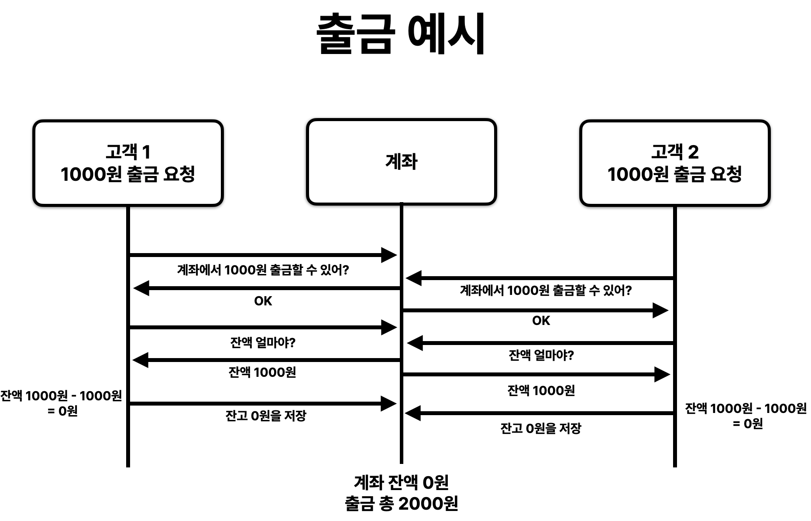
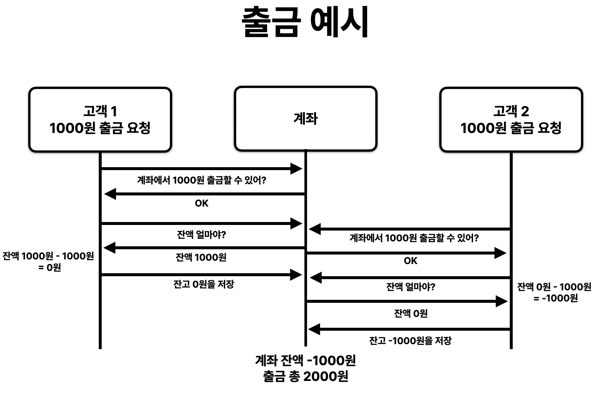
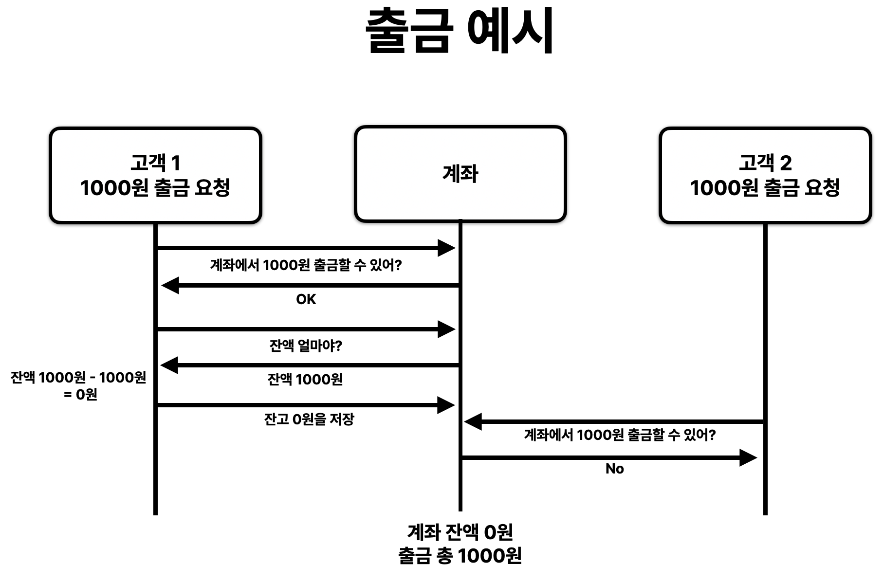
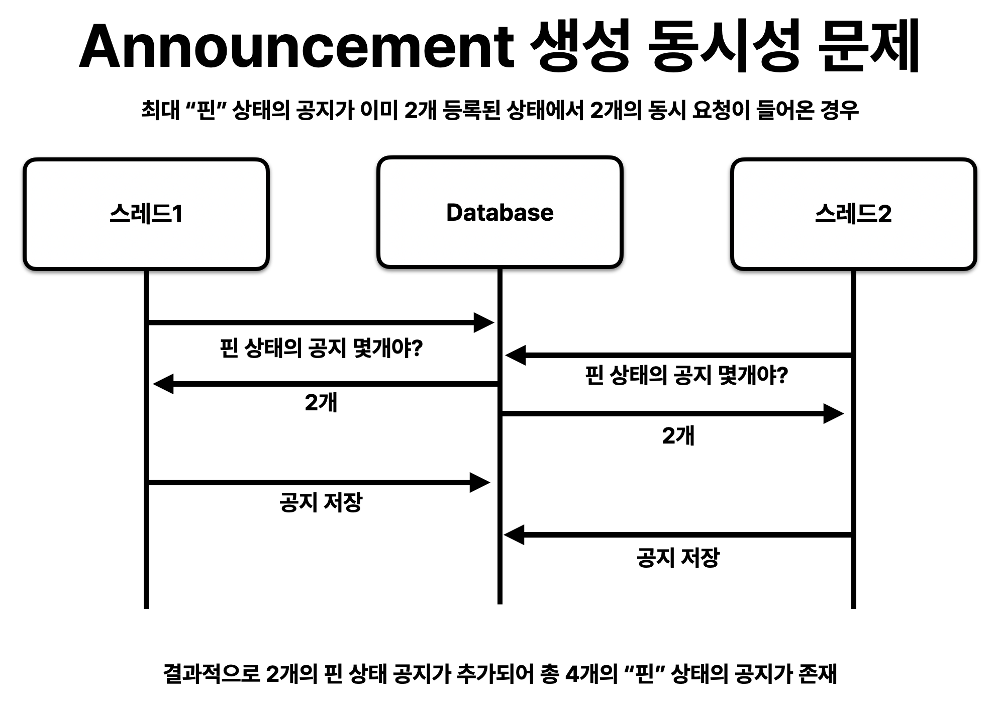
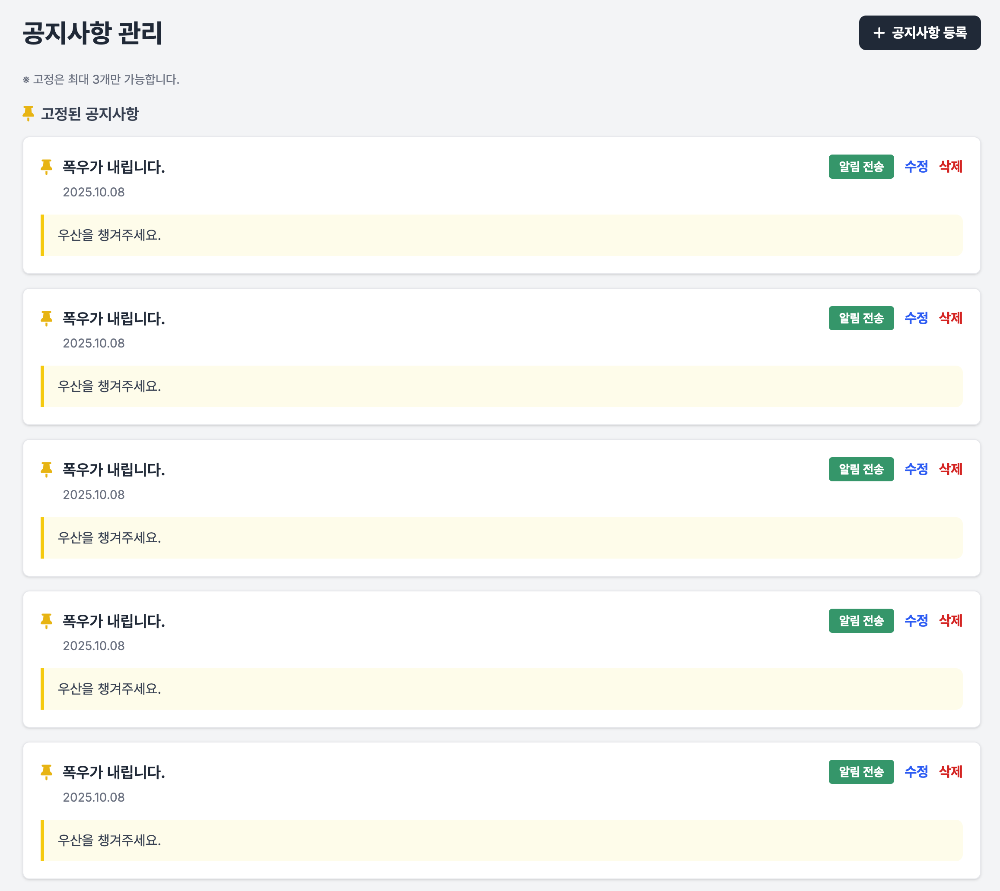
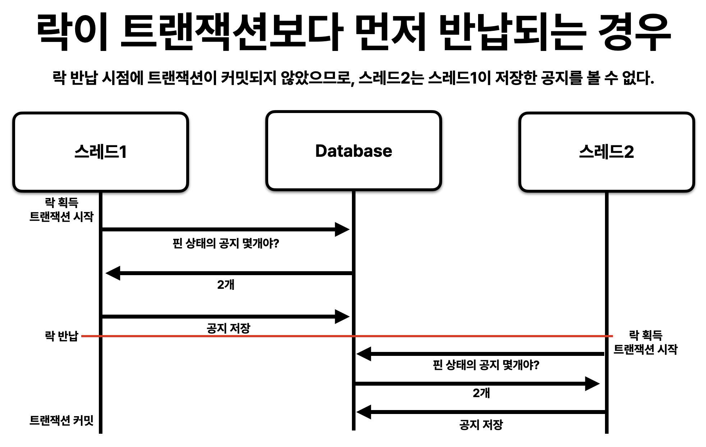
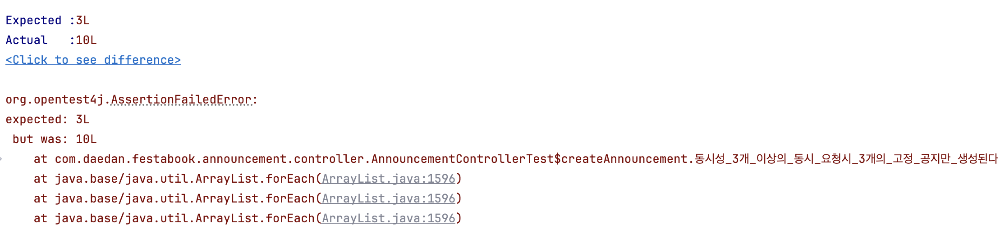
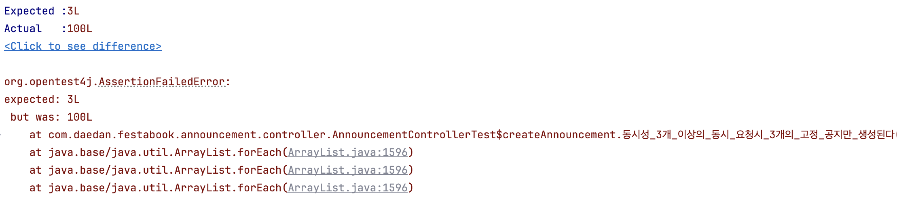
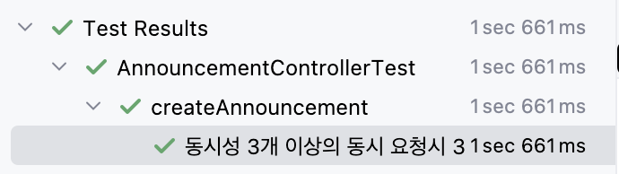

# festabook 동시성 문제 해결하기!
## 동시성 문제란?
동시성문제란 스레드, 프로세스, 트랜잭션과 같은 여러 실행 단위가 동일한 자원을 동시에 접근 또는 수정할 때 발생할 수 있는 예상치 못한 상호작용으로 인해 데이터의 정합성 또는 성능이 떨어지는 현상을 말한다.
이번 글에서는 주로 동시에 접근했을 때 실행 순서에 따라 항상 같은 결과가 아닌 다른 결과들이 발생해 비즈니스 규칙과 데이터 정합성이 깨지는 현상을 주로 알아볼 것이다.

### 레이스 컨디션이란?
레이스 컨디션은 경합 상태라 불리며, 여러 프로세스가 동시에 공유하는 자원에 접근함에 따라 일어나는 예상치 않은 이상이나 상태를 의미한다.
동시성 프로그래밍에서는 이 레이스 컨디션을 일으키지 않고 올바르게 프로그래밍하는지가 중요한 문제다.
예를 들어 하나의 계좌에 출금 로직이 다음과 같고, 동시에 요청이 2번 들어온다고 가정해보자 실행 순서에 따라 여러 상황이 발생할 수 있다.
```java
class Account {  
    private int money;  
  
    public Account(int money) {  
        this.money = money;  
    }  
  
    public void withdrawal(int money) {  
        if(this.money - money < 0) {  
            return;  
        }  
          
        this.money -= money;  
    }  
}
```

  
  
  

간단한 예시지만, 동시에 실행되는 경우 이렇게 다양한 상황이 발생한다. 문제는 우리가 예상한 결과는 3번째 상황이고 나머지는 우리가 생각한 규칙과 데이터 정합성에 문제가 생긴 것을 볼 수 있다.
# festabook의 사례로 알아보는 동시성 문제
이번엔 festabook 프로젝트를 진행하면서 실제로 발생한 상황에서는 어떤 문제가 발생한지 알아보자
## 핀 상태의 공지 만들기
우리 페스타북 서비스에서는 축제 관리자인 학생회가 축제에 대한 공지를 작성할 수 있고 특정 3개의 공지에 대해서는 상단에 고정시킬 수 있는 "핀"이라는 기능이 존재한다. 
다음은 공지를 작성하는 기능의 코드를 가져왔다.
```java
@Transactional  
public AnnouncementResponse createAnnouncement(Long festivalId, AnnouncementRequest request) {  
    Festival festival = getFestivalById(festivalId);  
    Announcement announcement = request.toEntity(festival);  
    if (request.isPinned()) {  
        validatePinnedLimit(festivalId);
    }
  
    announcementJpaRepository.save(announcement);
    return AnnouncementResponse.from(announcement);
}

private void validatePinnedLimit(Long festivalId) {  
    Long pinnedCount = announcementJpaRepository.countByFestivalIdAndIsPinnedTrue(festivalId);  
    if (pinnedCount >= MAX_PINNED_ANNOUNCEMENTS) {  
        // 예외 
    }  
}
```
1. festival을 조회한다.
2. Announcement 엔티티를 생성한다.
3. 만약 요청의 공지가 "핀" 상태라면 현재 추가적인 "핀" 상태의 공지가 3개 미만인지 검증한다.
4. Announcement 엔티티를 데이터베이스에 저장한다.

우리 서비스의 비즈니스 규칙에 맞게 이미 3개의 핀이 존재한다면 더 이상 "핀" 상태의 공지는 생성할 수 없게 검증을 하고 저장했다.
하지만, 여러 스레드가 동시 접근했을 때는 이야기가 달라진다. 여러 스레드가 메서드로 동시에 진입했을 때 검증과 데이터 수정이 동시에 일어나지 않기 때문에 두 연산 사이에 공간이 생긴다. 이 틈에 여러 스레드가 동시에 진입하게 된다면 검증을 통과한 스레드의 수 만큼 "핀" 상태의 공지가 등록될 수 있다. 그럼 결과적으로 "핀" 상태의 공지는 우리 팀이 정의한 3개라는 규칙을 넘어서서 존재할 수 있게 된다.

  
그림으로 보면 다음과 같은 순서대로 코드가 실행된다.
첫 번째 스레드의 검증이 종료된 후, 바로 공지가 생성되지 않기 때문에 두 번째 스레드의 검증도 통과할 수 밖에 없다.

다음은 k6를 이용해서 5개의 "핀" 상태의 공지 생성 요청을 동시에 보냈다.
  

  

요청은 5개 모두 201 Created로 성공했고, 학생회 페이지에서도 "핀" 상태의 공지사항이 5개 있는 것을 볼 수 있다.
비즈니스 규칙에 따라, 동시에 최대 3개의 고정된 공지가 존재할 수 있지만 동시성 문제로 인해 5개의 고정된 공지가 만들어졌다.
이 부분 말고도 검증-저장의 흐름을 가진 곳에서 같은 문제가 동일하게 나타났고 수정과 생성 사이에서도 발생했다.

# 동시성 문제 해결 방법
앞에서 설명했던 동시성 문제를 해결하는 방법들에 대해서 알아보자. festabook 서비스는 현재 MySQL 8.0 버전 InnoDB를 사용하고 있기 때문에 MySQL 8.0 버전의 문서를 바탕으로 작성할 것이다.

## 데이터베이스에서 제공해주는 동시성 문제 해결 방법
### 트랜잭션 격리 수준 설정
트랜잭션 격리 수준이란, 여러 트랜잭션이 동시에 처리될 때 특정 트랜잭션이 다른 트랜잭션에서 변경하거나 조회하는 데이터를 볼 수 있게 허용할지 말지를 결정하는 것이다. 즉, 트랜잭션 간에 보이는 데이터의 범위를 지정하는 방법이다.
MySQL 공식 문서에 따르면 SQL:1992 표준에 정의된 Read UNCOMMITTED, READ COMMITTED, REPEATABLE READ, SERIALIZABLE 격리 수준들을 모두 제공하고 기본적으로 MySQL의 InnoDB는 REPEATABLE READ 수준을 제공한다.
트랜잭션 격리 수준을 통해 우리는 어느정도 수준의 읽기 동시성을 제어할 수 있다.

이 방식은 레이스 컨디션 문제를 해결하기 위한 방법보다는, 가시성 일관성 문제를 해결하는 방법에 해당한다.
즉, 트랜잭션 격리 수준은 "읽기" 작업을 락 없이 처리하면서 트랜잭션 내에서 일관성을 지키는 수준을 설정하고 단일 트랜잭션 내에서의 읽기 작업의 일관성을 보장하기 위함이라는 것이다.
이는, 우리가 해결하려는 동시성 문제인 "여러 스레드가 동시에 공지를 생성할 때 비즈니스 규칙이 깨지는 현상"을 해결하지 못한다.
왜냐하면 festabook의 경우 두 트랜잭션이 동시에 실행될 때 가시성 문제로 인해 보이지 않거나 보여서 문제가 생기는 것이 아니라 실제로 그 시점에 존재하지 않기 때문이다.

### 공유락과 배타락
InnoDB는 공유락과 배타락이 있는 표준 행 수준 잠금을 구현합니다. 공유락은 락을 보유하는 트랜잭션이 행을 읽을 수 있도록 허용합니다. 배타락을 획득한다면 락을 보유한 트랜잭션이 행을 업데이트하거나 삭제할 수 있습니다.
트랜잭션 T1과 T2가 있고 락을 걸 대상인 행 R이 있다고 가정해보자. 
만약 공유락을 T1이 획득했다면 T2의 요청은 즉시 실행될 수 있고, 결과적으로 T1과 T2는 모두 R에 대해 공유락을 획득하고 소유할 수 있다. 반면에 배타락을 T1이 먼저 획득했다면 T2는 배타락을 즉시 획득할 수 없다. 또한, R에 대한 공유락도 획득할 수 없다. 즉, 배타락은 하나의 트랜잭션만 소유할 수 있으며 공유락의 획득도 막는다.
festabook의 문제에서 배타락을 사용하면 해결할 수 있을 것 같지만, 불가능하다. 공지 생성의 경우 예시 상황처럼 R이 존재하는 상황이 아니다. 따라서 공유락/배타락 어떤 것도 획득하고 트랜잭션을 수행할 수 없다.

### 레코드 락
레코드 자체만 잠그는 것을 레코드 락이라고 한다. InnoDB에서는 레코드 자체가 아니라 인덱스의 레코드를 잠근다.
```sql
SELECT c1
FROM t
WHERE c1 = 10
FOR UPDATE;
```
t의 c1 컬럼이 10인 행을 삽입, 수정, 삭제하는 것을 방지한다. 조회는 가능하다.

### 갭 락
인덱스 레코드 사이의 틈 즉, 아직 존재하지 않는 값의 구간에 거는 락이다. 
특정 구간에 새 레코드가 삽입되는 것을 차단하지만, 기존 데이터를 읽거나 수정은 허용된다.
다른 트랜잭션이 같은 갭락을 거는 건 가능하기 때문에 서로 호환된다.
```sql
-- salary 인덱스가 있고, 현재 값은 [3000, 5000, 8000]
SELECT * FROM employees
WHERE salary BETWEEN 4000 AND 6000
FOR UPDATE;
```
실제 행인 5000에 락을 걸고 그 앞뒤 구간인 4000 ~ 5000, 5000 ~ 6000에 갭 락을 걸게된다.
그럼, 다른 트랜잭션은 `salary = 5000`같은 새 값을 삽입하려하면 대기하게 된다.

### 넥스트키 락
하나의 인덱스 레코드 락 + 그 앞 갭 락을 묶어서 사용하는 방법이다. 즉, 레코드 자신과 그 앞의 구간을 한꺼번에 락을 건다.
```sql
-- price 인덱스가 있고, 현재 값은 [100, 150, 180]
SELECT * FROM orders
WHERE price BETWEEN 100 AND 200
FOR UPDATE;
```
해당 행에 레코드 락을 걸고, 그 바로 앞 구간에 갭 락을 동시에 건다.
결과적으로 100 ~ 200 범위 안에 새로운 주문을 삽입할 수 없다.
갭 락과의 주요 차이점은, 갭 락은 범위에 대한 삽입만 방지하지만 넥스트키 락의 경우 레코드를 포함해서 삽입/수정/삭제를 모두 막는다.
festabook의 경우 작업 도중 수정이 발생해서, 핀 상태의 공지가 추가로 생기면 안되기 때문에 넥스트키 락을 사용할 수 있을 것이다.

### 네임드 락
네임드 락은 특정 문자열에 대해 잠금을 설정할 수 있다. 대상이 특정 테이블이나 레코드가 아니라 사용자가 지정한 문자열에 대해 데이터를 획득하고 반납한다.

```sql
-- 최대 2초 동안 대기하면서 'AnnouncementService::createAnnouncement1' 문자열에 대해 락을 획득을 요청한다.
SELECT GET_LCOK('AnnouncementService::createAnnouncement1', 2);

-- 'AnnouncementService::createAnnouncement1' 락을 반납한다.
SELECT RELEASE_LOCK('AnnouncementService::createAnnouncement1');
```

festabook의 경우에 개발자가 임의로 지정한 문자열에 대해 락을 획득할 수 있으므로 사용할 수 있을 것이다.
## 애플리케이션 수준의 동시성 문제 해결 방법
앞에서는 데이터베이스 수준에서 동시성 문제를 해결하는 방법들에 대해서 알아봤다. 이제 애플리케이션 수준에서 동시성 문제를 해결할 수 있는 방법을 알아보자.
### 낙관적 락
낙관적 락은 "데이터 충돌이 드물게 일어날 것이다"라고 낙관하고, 락을 걸지 않은 채 작업을 진행한 후 **커밋 직전에만 충돌 여부를 확인**하는 방식이다.
1. 먼저 데이터에 버전을 나타내는 컬럼을 추가한다.
2. 트랜잭션을 시작할 때 버전 번호를 읽는다.
3. 수정을 시도할 때 "내가 읽었던 버전과 현재 DB의 버전이 같은지" 확인한다. 만약 버전이 다르다면 충돌이 발생했으므로, 업데이트를 취소하고 예외를 발생시켜 재시도를 유도한다. 만약 버전이 같다면 수정이 없었다고 판단하고 버전 번호를 1 증가시킨다.
락이 없기 때문에 동시성(성능)이 높지만 충돌 시 작업이 실패하고 재시도가 필요하다. 따라서 데이터 충돌이 드물게 일어나는 상황에서 사용한다면 장점이 두드러질 것이다.
festabook의 경우 학생회 여러명이 동시에 같은 데이터를 수정하는 상황이 발생할 가능성이 낮기 때문에 낙관적 락을 사용하면 좋겠지만 앞에서 봤던 상황은 삽입에서 발생하는 동시성 문제이기 때문에 데이터베이스 컬럼을 활용하는 낙관적 락 방식을 사용하기 어렵다.

### 비관적 락
비관적 락은 "데이터 충돌이 일어날 가능성이 높다"고 비관하고, 아예 처음부터 자원을 독점하는 방식이다.
데이터를 읽는 시점에 데이터베이스의 "베타적 락"을 건다. 트랜잭션이 끝날 때까지 락을 풀지 않고 다른 모든 트랜잭션의 접근(읽기, 쓰기)를 차단하고 강제로 순차 처리를 한다. 주로 데이터베이스 내장 기능을 사용한다. SQL로는 주로 `SELECT ... FOR UPDATE` 구문을 사용한다.
데이터 정합성은 확실히 보장되지만, 다른 트랜잭션들이 락이 풀릴 때까지 대기해야 하므로 **동시성이 떨어진다.**
festabook의 경우 앞에서 말했듯이 데이터베이스 row가 존재해야만 사용할 수 있는 배타락을 활용하기 때문에 사용하기 어렵다.

### 분산 락
분산 락 방식은 여러 개의 독립적인 서버가 하나의 공유 자원에 동시에 접근하는 분산 환경에서 동시성 문제를 해결하는 방법이다.
일반적인 DB 락은 단일 DB 내에서만 효과가 있지만, 서버가 여러 대일 때는 모든 서버가 접근할 수 있는 중앙 집중형 잠금 관리자가 필요하다
분산 락은 여러 서버 중 오직 한 서버만이 특정 시점에 공유 자원에 대한 배타적인 권한을 얻도록 보장하는 매커니즘이다.
festabook의 경우에 사용해볼 수 있지만 분산 환경이 아닌데, 새로운 저장소까지 추가해야하는 상황은 단점으로 다가왔다.

# festabook에서 선택한 동시성 문제 해결 방법
앞에서 봤던 해결 방법들 중에서, festabook에 적용할 수 있는 방법들을 나열하고 현재 상황에 맞게 비교해보았다.
## 넥스트키 락
넥스트키 락의 장점은 다음과 같다.
- 인프라에 애플리케이션 오토 스케일링을 추가하는 등 수평 확장을 고려하는 경우에도 그대로 사용할 수 있다.
- DB의 데드락 탐지 기능을 그대로 활용할 수 있다.
- 트랜잭션 내에서 자동으로 관리되어 별도의 락 해제 로직이 필요 없다.

넥스트키 락의 단점은 다음과 같다.
- 비싼 데이터베이스의 자원을 사용해야 한다.
- 데이터베이스가 확장될 경우(샤딩, 파티셔닝, 마스터-레플리카)를 고려해야 한다.
- 락의 대상을 개발자가 임의로 설정할 수 없고 범위로 지정해야하므로 불편하다.
- 데이터베이스에서 데드락 관련 문제가 발생하기 때문에 디버깅이 어렵다.

## 네임드 락
네임드락의 장점은 다음과 같다.
- 락의 대상을 개발자 임의로 설정할 수 있어 자유롭다.
- 락 대기 시간을 명시적으로 지정할 수 있다.
- DB의 데드락 탐지 기능을 그대로 활용할 수 있다.
- 인프라에 애플리케이션 오토 스케일링을 추가하는 등 수평 확장을 고려하는 경우에도 그대로 사용할 수 있다.

네임드락의 단점은 다음과 같다.
- 비싼 데이터베이스의 자원을 사용해야 한다.
- 데이터베이스가 확장될 경우(샤딩, 파티셔닝, 마스터-레플리카)를 고려해야 한다.

## 분산락
분산락의 장점은 다음과 같다.
- 락의 대상을 개발자 임의로 설정할 수 있어 자유롭다.
- 비싼 데이터베이스의 자원을 활용하지 않는다.
- 데이터베이스가 확장될 경우(샤딩, 파티셔닝, 마스터-레플리카)를 고려하지 않아도 된다.
- 인프라에 애플리케이션 오토 스케일링을 추가하는 등 수평 확장을 고려하는 경우에도 그대로 사용할 수 있다.
- 인메모리 저장소를 활용하므로 데이터베이스보다 빠르다.

분산락의 단점은 다음과 같다.
- Redis와 같은 외부 저장소를 사용해야하기 때문에 인프라 복잡도와 비용이 증가한다. 
- 외부 저장소 장애 발생 시 애플리케이션에 문제가 발생한다.
- 데드락을 직접 고려해서 임대 시간을 설정해줘야한다.
## festabook의 선택
festabook에서는 분산락 방식을 그대로 차용해서 사용하면서 저장소를 Redis가 아닌 자바의 컬렉션을 활용하기로 결정했다. 이유는 다음과 같다.
1. 애플리케이션의 경우 수평 확장을 통해 비교적 저렴하게 확장할 수 있지만 데이터베이스 자원은 비싸기 때문에 사용을 최소화하자는 팀의 의견이 있었다.
2. 우리 서비스의 경우 데이터의 수정이 비교적 빠르게 적용될 필요가 없기 때문에 데이터베이스의 마스터-레플리카 구조를 고려하고 있었다.
3. Redis와 같은 외부 저장소를 사용하지 않고 자바 컬렉션을 활용하여 메모리의 빠른 속도를 가져가면서 인프라 추가로 발생하는 인적 비용과 금전적인 비용이 크지 않을 것이라 판단했다.
4. 확장성을 고려하여 저장소를 인터페이스로 추상화하면 수평 확장을 고려할 때 쉽게 코드를 변경할 수 있을 것이라 판단했다.

# festabook의 인메모리 락 구현
## 구현 목록
- LockAspect: 비즈니스 로직에 락 획득/반납 코드를 드러내지 않고 코드를 묶어내고 트랜잭션 범위 밖에서 락 획득/반납을 위해 Spring AOP를 활용했다.
- Lockable: 적용할 메서드에 추가하는 어노테이션으로 락과 관련된 정보들을 담는다.
- LockStorage: Aspect의 입장에서 필요한 메서드를 인터페이스로 추상화했다.
- InMemoryLockStorage: 실제 락을 자바 컬렉션으로 구현한 구현체이다.
- Lock: 락의 정보들을 담는 객체이다.

## LockAspect
```java
@Slf4j  
@Aspect  
@Loggable  
@Component  
@RequiredArgsConstructor  
@Order(Ordered.HIGHEST_PRECEDENCE - 10)  
public class LockAspect {  
  
    private static final String DEFAULT_KEY_PREFIX_FORMAT = "%s::%s";  
  
    private final LockStorage lockStorage;  
  
    @Around("@annotation(com.daedan.festabook.global.lock.Lockable)")  
    public Object lock(ProceedingJoinPoint joinPoint) throws Throwable {  
        MethodSignature signature = (MethodSignature) joinPoint.getSignature();  
        Method method = signature.getMethod();  
        Lockable lockable = method.getAnnotation(Lockable.class);  
  
        String keyPrefix = createKeyPrefix(lockable, signature);  
        String parsedKey = keyPrefix + parseSpel(  
                signature.getParameterNames(),  
                joinPoint.getArgs(),  
                lockable.spelKey()  
        );  
        boolean isLockAcquired = false;  
        try {  
            lockStorage.tryLock(  
                    parsedKey,  
                    lockable.waitTime(),  
                    lockable.leaseTime(),  
                    lockable.timeUnit()  
            );  
            isLockAcquired = true;  
  
            return joinPoint.proceed();  
        } finally {  
            if (isLockAcquired) {  
                lockStorage.unlock(parsedKey);  
            }  
        }  
    }  
  
    public String parseSpel(String[] parameterNames, Object[] args, String key) {  
        ExpressionParser parser = new SpelExpressionParser();  
        StandardEvaluationContext context = new StandardEvaluationContext();  
  
        for (int i = 0; i < parameterNames.length; i++) {  
            context.setVariable(parameterNames[i], args[i]);  
        }  
  
        return parser.parseExpression(key).getValue(context, String.class);  
    }  
  
    public String createKeyPrefix(Lockable lockable, MethodSignature signature) {  
        if (lockable.usePrefix()) {  
            String className = signature.getDeclaringType().getSimpleName();  
            String methodName = signature.getName();  
  
            return String.format(DEFAULT_KEY_PREFIX_FORMAT, className, methodName);  
        }  
  
        return "";  
    }  
}
```
`@Lockable` 어노테이션으로부터 정보를 가져와서 락을 획득하고 반납합니다.

1. 만약 usePrefix 옵션이 true로 설정되어 있다면 keyPrefix를 `ClassName::methodName` 형태로 생성하여 키의 prefix로 추가해줍니다. 동적인 값들만 작성하는 경우 반복적으로 작성되는 클래스 명 + 메서드 명을 자동으로 설정해주기 위해 사용합니다.
2. SpEL로 작성된 키를 동적으로 키를 파싱합니다. 어노테이션에는 메서드 매개변수 값들을 동적으로 넣어줄 수 없기 때문에 런타임에 리플렉션을 활용해 가져와서 생성하기 위해 사용합니다.
3. lockStorage로부터 락을 획득을 시도합니다.
4. 락 획득 여부를 기록합니다. 이는 finally 블럭 내부에서 락을 반납할 때 락 획득을 하지 못한 상태라면 반납하는 메서드를 호출하지 않기 위함입니다.
5. proceed()를 호출하여 다음 프록시 또는 비즈니스 로직을 호출합니다.

`@Order`를 설정한 이유는 Aspect의 프록시 순서를 명시적으로 설정해주기 위해서 사용했습니다. 락은 트랜잭션이 종료된 후 그리고 로그 후에 실행되어야 하므로 이렇게 명시적으로 설정했습니다.
`@Transactional` 어노테이션의 경우 명시적으로 지정하지 않으면 `Ordered.LOWEST_PRECEDENCE`이 적용됩니다.

### 왜 락이 트랜잭션이 종료된 후 반납해야할까?
락이 트랜잭션보다 먼저 반납될 경우, 다른 스레드들이 락을 획득했을 때 이전 작업의 결과를 볼 수 없고 여전히 동시성 문제가 발생함
  
1. 스레드 1이 락을 획득하고 트랜잭션을 시작함
2. 작업을 수행하고, 락을 반납한다.
3. 스레드 2가 락을 획득하고 트랜잭션을 시작한다.
4. 이때, 핀 상태의 공지를 조회하면 스레드 1이 저장한 공지는 커밋되지 않았기 때문에 여전히 2개이다.
5. 따라서 스레드 2도 공지사항을 생성하고, 결과적으로 4개의 핀 상태의 공지가 생성된다.
따라서 락이 트랜잭션보다 먼저 획득하고, 커밋된 이후 반납할 수 있도록 `@Order`를 통해 순서를 명시했습니다.
## Lockable
```java
@Target(ElementType.METHOD)  
@Retention(RetentionPolicy.RUNTIME)  
public @interface Lockable {  
  
	// SpEL 문법으로 작성된 키 값
    String spelKey();  
  
	// 클래스이름::메서드이름으로 정의된 기본 prefix를 사용할지 여부
    boolean usePrefix() default false;  
  
	// waitTime과 leaseTime의 시간 단위
    TimeUnit timeUnit() default TimeUnit.SECONDS;  
	
	// 락 대기 시간
    long waitTime() default 5L;  
  
	// 락 임대 시간
    long leaseTime() default 3L;  
}
```
AOP를 적용할 메서드에 붙이는 어노테이션이다. 스프링 빈으로 등록될 때, `Lockable` 어노테이션이 붙은 메서드에 프록시를 추가해준다. 이 정보를 바탕으로 락을 획득/반납한다.
SpEL 문법으로 키를 작성하는 이유는 문자열로 된 값을 실행 시점에 동적으로 파싱하기 위해 사용했다.
## LockStorage
```java
public interface LockStorage {  
  
    void tryLock(String key, long waitTime, long leaseTime, TimeUnit timeUnit);  
  
    void unlock(String key);  
}
```
우리 애플리케이션에서 사용할 기능을 추상화한 인터페이스이다.
추후 LockStorage를 인메모리에서 Redis와 같은 외부 저장소로 변경할 때 Aspect의 변경 없이 해당 인터페이스를 구현해서 빈만 교체하려고 만들었다.
때문에 인프라에 애플리케이션 오토 스케일링이 추가되어 애플리케이션 내부 저장소를 사용할 수 없을 때 변경을 최소화할 수 있다.
## Lock
```java
public class Lock {  
  
    private volatile long ownerThreadId;  
    private volatile ScheduledFuture<?> leaseTimeOutSchedule;  
  
    public synchronized void registerOwnerThreadId(long ownerThreadId) {  
        this.ownerThreadId = ownerThreadId;  
    }  
  
    public synchronized void registerLeaseTimeOutSchedule(ScheduledFuture<?> leaseTimeOutSchedule) {  
        cancelIfExistsLeaseTimeOutSchedule();  
        this.leaseTimeOutSchedule = leaseTimeOutSchedule;  
    }  
  
    public synchronized void cancelIfExistsLeaseTimeOutSchedule() {  
        if (leaseTimeOutSchedule != null) {  
            leaseTimeOutSchedule.cancel(false);  
        }  
    }  
  
    public synchronized boolean isOwner(long threadId) {  
        return ownerThreadId == threadId;  
    }  
}
```
Lock 클래스는 락 정보를 담아두기 위해서 사용하는 클래스이다.
- `ownerThreadId`는 락을 획득한 스레드의 id를 저장한다. 추후, 락을 반납할 때 락을 획득한 스레드가 맞는지 확인하는 용도로 저장한다.
- `leaseTimeOutSchedule`는 락을 반납할 때 예약해둔 "임대 기간 만료 강제 반납"의 실행을 취소하기 위해 저장한다.

synchronized를 붙인 이유는 각 메서드 로직을 묶어서 원자성을 보장하기 위해서이다. 모든 필드들이 synchronized 메서드 내부에서 접근하는데 volatile 키워드를 붙여준 이유는 컨텍스트가 유지되지 않은 경우에 실수할 경우를 방지하고 메모리 가시성 문제를 최대한 방지하기 위해 명시적으로 붙여주었다.

## InMemoryLockStorage
```java
@Loggable  
@Component  
public class InMemoryLockStorage implements LockStorage {  
  
	// locks는 Lock을 저장하는 저장소이다. ConcurrentHashMap을 사용하여 동시성을 보장한다.
    private final ConcurrentHashMap<String, Lock> locks = new ConcurrentHashMap<>();  
    
    // 특정 시간 후에 실행될 "임대 시간 만료 락 강제 반납"을 실행할 스케줄러 스레드이다.
    private final ScheduledExecutorService scheduler =  
            Executors.newSingleThreadScheduledExecutor(r ->  
                    new Thread(r, "lock-lease-time-out-scheduler")  
            );  
  
	// 락을 획득하거나 획득을 위해 대기한다.
	@Override  
	public void tryLock(String key, long waitTime, long leaseTime, TimeUnit timeUnit) {  
		validateEmptyKey(key);  
		long deadline = System.nanoTime() + timeUnit.toNanos(waitTime);  
		long currentThreadId = Thread.currentThread().getId();  
	  
		Lock emptyLock = new Lock();  
		while (true) {  
			// 1
			Lock existing = locks.putIfAbsent(key, emptyLock);  
			if (existing == null) {  
				emptyLock.registerOwnerThreadId(currentThreadId);  
				emptyLock.registerLeaseTimeOutSchedule(  
						scheduler.schedule(leaseTimeOutSchedule(key, emptyLock), leaseTime, timeUnit)  
				);  
				return;  
			}  
	  
			// 2
			synchronized (existing) {  
				validateLockTimeOut(deadline);  
				try {  
					long nanosLeft = deadline - System.nanoTime();  
					long millisPart = calculateMillisPart(nanosLeft);  
					int nanosPart = calculateNanosPart(nanosLeft, millisPart);  
					existing.wait(millisPart, nanosPart);  
					validateLockTimeOut(deadline);  
				} catch (InterruptedException ignore) {  
				}  
			}  
		}  
	}  
  
	// 락을 반납한다.
    @Override  
    public void unlock(String key) {  
        validateEmptyKey(key);  
        Lock lock = locks.get(key);  
        validateNotExistsLock(lock);  
  
        // 3
        synchronized (lock) {  
            long currentThreadId = Thread.currentThread().getId();  
            validateLockOwner(lock, currentThreadId);  
  
            lock.cancelIfExistsLeaseTimeOutSchedule();  
            locks.remove(key, lock);  
            lock.notifyAll();  
        }  
    }  
  
	// 4
    private Runnable leaseTimeOutSchedule(String key, Lock lock) {  
        return () -> {  
            Lock currentLock = locks.get(key);  
            if (currentLock == null) {  
                return;  
            }  
            synchronized (currentLock) {  
                if (currentLock == lock) {  
                    locks.remove(key, currentLock);  
                    currentLock.notifyAll();
                }  
            }  
        };  
    }
```
1. 락 획득을 시도한다. 이때 컬렉션이 ConcurrentHashMap이므로 여러 스레드가 접근하더라도 동시성이 보장된다.
	- 만약 null을 반환한다면 기존에 락이 존재하지 않았고 성공적으로 락을 저장소에 저장했다는 것을 의미한다. 락에 현재 스레드의 id를 기입하고 주어진 임대 시간 후에 반납 로직을 수행하도록 스케줄러에 등록한다.
	- 만약 null이 아닌 Lock 객체를 반환한다면 이는, 기존에 락이 존재한다는 의미이므로 락을 등록하지 않고 대기한다.
2. 대기하기 전에 스레드는 타임아웃인지 검증한다. 그러고 난 후, waitTime에 명시한 시간동안 `.wait()`을 호출해 대기 상태로 간다.
	- synchronized를 사용한 이유는 wait() 메서드가 해당 블럭 내부에서만 사용이 가능하기 때문이고 반납 시점에 깨워주기 위함이다. 이를 통해 반복문을 사용한 busy wait을 하지 않아도 되므로 스레드들을 CPU 경합 없는 상태로 대기시킬 수 있다.
	- 락 반납 과정에서 notifyAll()을 호출하거나, 지정한 시간 이후에 스레드는 깨어난다. 그러고 난 후 timeout을 한번 더 검증한다.
3. 락을 반납한다. 이때 synchronized 블럭으로 감싼 이유는 해당 락 인스턴스의 wait()을 호출한 스레드들을 notifyAll()로 모두 깨우기 위함이다. 
4. 임대 시간이 만료되었을 경우 강제로 락을 반납하는 로직이다. 이를 통해 최악의 경우 데드락을 방지하는 조치로 작동한다. 이 시간이 너무 짧으면 작업 수행 도중 락이 반납되기 때문에 개발자는 최악의 경우를 고려하여 시간을 설정해야 한다.
	- currentLock이 이미 반납된 경우는 임대 시간 만료 로직 실행과 락 반납 로직 실행이 동시에 실행되어 락 반납이 먼저 이뤄진 경우 한번 더 삭제하는 것을 방지하기 위함이다.
	- synchronized 블럭 내부의 if문은 앞의 상황과 비슷하게 동시에 실행된 경우 새로운 락이 들어와 저장되었다면 삭제하면 안되기 때문에 임대 시간 만료 로직을 등록할 때의 인스턴스와 락 저장소에서 조회한 락 인스턴스가 같은지 비교한다.

## 동시성 테스트
마지막으로 완성된 락을 테스트해 동시성 문제가 발생하지 않음을 눈으로 확인하고 싶었다. 하지만 레이스 컨디션 문제는 스레드들을 어떤 순서대로 접근하느냐에 따라 다른 결과가 나타나는 현상으로 발생했던 문제를 완벽히 재현해내기는 어렵다고 판단했다.
그래서 100개 정도의 스레드를 만들어 동시 요청을 보내 최대한 동시성 문제가 발생하도록 테스트했다.

```java
    @Test  
    void _3개_이상의_동시_요청시_3개의_고정_공지만_생성된다() {  
        // given  
        // 준비...
        int concurrencyRequestCount = 100;  
        int startFlag = 1;  
        ExecutorService threadPool = Executors.newFixedThreadPool(concurrencyRequestCount);  
  
        CountDownLatch startLatch = new CountDownLatch(startFlag);  
        CountDownLatch endLatch = new CountDownLatch(concurrencyRequestCount);  
  
        for (int i = 0; i < concurrencyRequestCount; i++) {  
            threadPool.submit(() -> {  
                try {  
                    startLatch.await();  
  
                    RestAssured  
                            .given()  
                            .header(authorizationHeader)  
                            .contentType(ContentType.JSON)  
                            .body(request)  
                            .when()  
                            .post("/announcements");  
                } catch (InterruptedException ignore) {  
                } finally {  
                    endLatch.countDown();  
                }  
            });  
        }  
  
        int expectedPinnedAnnouncementCount = 3;  
  
        // when  
        // 스레드 실행 스타트 신호
        startLatch.countDown();  
  
		// 모든 스레드가 종료할 때까지 테스트 메인 스레드를 대기
        try {  
            endLatch.await();  
        } catch (InterruptedException ignore) {  
        }  
  
        // then  
        Long result = announcementJpaRepository.countByFestivalIdAndIsPinnedTrue(festival.getId());  
        assertThat(result).isEqualTo(expectedPinnedAnnouncementCount);  
  
        threadPool.close();  
    }  
}
```
- CountDownLatch를 사용해 스레드들을 동시에 출발시키고, 종료를 카운트하도록 만들었다.
- 스레드 풀에 `submit()`을 호출하는 Runnable 람다를 보면 startLatch.await()을 호출해 대기하도록 하고, startLatch.countDown()에 맞춰 동시에 출발하도록 했다.

    
결과를 보면 10개의 핀 상태의 공지가 생성된 것을 볼 수 있는데, 이는 HikariCP의 커넥션 수가 10개가 존재하기 때문에 10개의 트랜잭션이 열린 후 나머지 스레드들은 커넥션 대기를 하기 때문에 더 생성되지 못했다.

```yml
spring:  
  datasource:  
    hikari:  
      maximum-pool-size: 100
```
커넥션수를 높이고 다시 테스트를 진행해보면 다음과 같이 100개가 생성된 것을 볼 수 있다.

    

우리의 목적이었던 동시성을 제어하기 위해서 다음과 같이 로직에 어노테이션을 추가해줬다.

```java
@Lockable(spelKey = "'AnnouncementService::createAnnouncement'.concat(#festivalId)")  
@Transactional  
public AnnouncementResponse createAnnouncement(Long festivalId, AnnouncementRequest request)
```
Announcement 생성의 경우 festivalId 별로 격리되도록 해주면 되기 때문에 위와 같이 키에 festivalId를 추가해주었다.

  
그럼 정상적으로 3개의 핀 상태의 공지 생성 후 다른 스레드들은 모두 검증에서 예외가 발생해서 생성되지 않은 것을 볼 수 있다.

# 마무리
festabook의 동시성 문제를 해결해나가기 위해 고민했던 기술들 그리고 어떻게 구현했는지 설명했습니다. 기존 서비스 레이어의 로직들에 락과 관련된 로직들을 노출하지 않고 어노테이션만으로 제어하여 서비스 레이어에서는 로직만 볼 수 있게 만들었다.
추후 외부 저장소로 변경될 때도 LockStorage만 따로 구현해서 빈만 변경해주면 LockAspect와 Service 레이어들은 변경이 없기 때문에 확장성도 좋다고 생각한다.
처음으로 락에 대해서 많은 고민을 해보고 InMemoryLockStorage를 구현하면서 동시성에 대해서도 많이 고민해서 재밌었다. 기존의 테스트들과 다른 성격의 테스트들도 해보면서 스레드에 대해서 더 다룰 수 있게 된 것 같아 신난다.


##### 출처
- https://stackoverflow.com/questions/34510/what-is-a-race-condition
- https://en.wikipedia.org/wiki/Concurrency_(computer_science)
- https://tech.kakaopay.com/post/troubleshooting-logs-as-a-junior-developer/
- https://product.kyobobook.co.kr/detail/S000001810499
- https://dev.mysql.com/doc/refman/8.0/en/innodb-transaction-isolation-levels.html
- https://dev.mysql.com/doc/refman/8.0/en/innodb-locking.html
- https://product.kyobobook.co.kr/detail/S000001766482