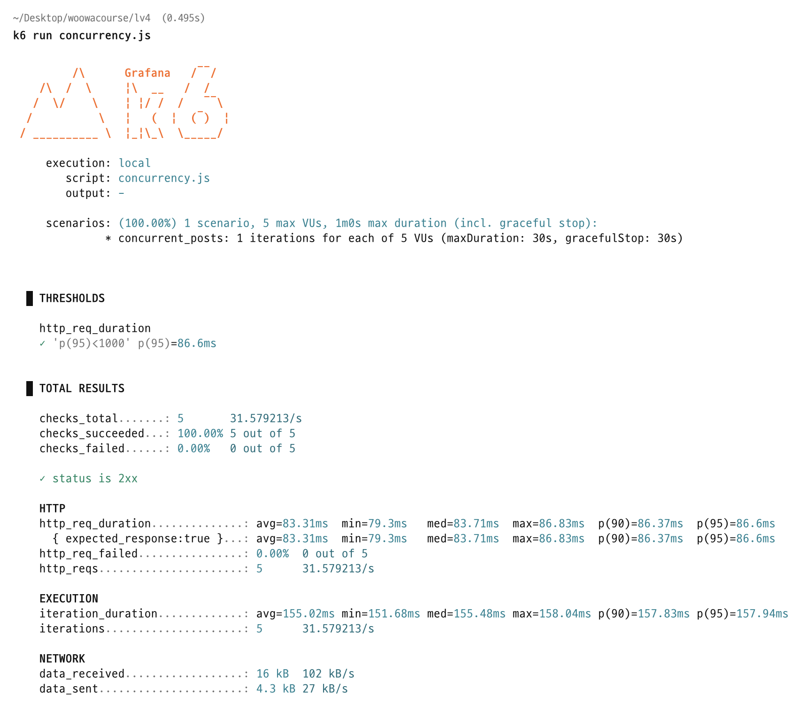

# festabook 동시성 문제, 이렇게 막았다!

## 들어가며
이 글은 festabook에서 동시성 문제를 어떻게 발견하고 검증하고 해결했는지, 의사결정과 테스트까지 한 흐름으로 정리합니다. 대상 독자는 다음과 같습니다.  

- 동시성의 개념은 알지만 실전 해결 절차가 필요한 분
- 문제가 재발하지 않음을 증명하는 테스트 방법이 궁금한 분
- 단일 애플리케이션에서 개발자 정의 키로 락을 적용하는 방법이 필요한 분


## festabook에서 발생했던 동시성 문제
여러 지점에서 유사한 문제가 있었지만, 여기서는 핀 상태 공지 생성에서 드러난 사례를 설명합니다.

### 핀 상태의 공지 만들기
festabook에서는 학생회가 공지를 작성하고, 최대 3개를 사용자 앱 공지 상단에 고정(핀)할 수 있습니다. 아래는 공지 생성 코드입니다.

```java
@Transactional  
public AnnouncementResponse createAnnouncement(Long festivalId, AnnouncementRequest request) {  
    Festival festival = getFestivalById(festivalId);  
    Announcement announcement = request.toEntity(festival);  
    if (request.isPinned()) {  
        validatePinnedLimit(festivalId);
    }
  
    announcementJpaRepository.save(announcement);
    return AnnouncementResponse.from(announcement);
}

private void validatePinnedLimit(Long festivalId) {  
    Long pinnedCount = announcementJpaRepository.countByFestivalIdAndIsPinnedTrue(festivalId);  
    if (pinnedCount >= MAX_PINNED_ANNOUNCEMENTS) {  
        // 예외 
    }  
}
```
동작 흐름은 다음과 같습니다.  
1. 축제를 조회합니다.
2. 공지 엔티티를 생성합니다.
3. 핀 요청이면 현재 핀 개수가 3개 미만인지 검증합니다.
4. 공지를 저장합니다.

비즈니스 규칙은 간단합니다. 핀 공지는 축제별 최대 3개만 허용합니다. 따라서 핀 요청이 오면 현재 개수를 확인하고, 2개 이하일 때만 저장합니다.  
문제는 동시 접근입니다. 여러 스레드가 동시에 메서드에 진입하면, 검증과 저장 사이에 틈이 생깁니다. 그 사이에 다른 스레드도 동일한 검증을 통과해 저장까지 도달할 수 있습니다. **그 결과 같은 축제에서 핀 공지가 3개를 넘어 생성됩니다.**

festabook에서는 동시 생성 시 위와 같은 경쟁 조건이 실제로 발생했고, 규칙을 초과하는 핀 공지가 만들어졌습니다.

### 동시성 문제 재현
k6로 핀 상태 공지 생성 요청 5건을 동시에 전송했습니다.

<p align="center">
    
</p>

<p align="center">
    
</p>

요청 5건이 모두 201 Created로 성공했고, 학생회 페이지에서도 핀 공지가 5개로 표시되었습니다.  
비즈니스 규칙상 축제별 핀 공지는 최대 3개여야 하지만, 동시성 문제로 인해 5개가 생성되었습니다. 왜 이런 일이 발생하는지 흐름을 간단히 설명합니다.

<p align="center">
    
</p>

핵심 원인을 요약하면 다음과 같습니다.
- 첫 번째 스레드가 검증을 통과한 직후 저장되기 전에, 두 번째 스레드도 동일한 검증을 통과합니다.
- 두 스레드가 모두 저장 단계에 도달하면서, 결과적으로 핀 공지가 규칙(3개)을 초과해 생성됩니다.
- 동일한 패턴은 검증-저장 흐름뿐 아니라 수정 후, 저장 구간에서도 재현됩니다.

## festabook에서 선택한 동시성 문제 해결 방법
동일 시점 삽입 경쟁을 제어하기 위해 여러 방식을 검토했고, 단일 인스턴스 전제에서 인메모리 분산락 패턴을 적용했습니다.  
- 여기서, 분산 락 패턴은 분산 락을 참고하여 직접 단일 인스턴스 내부 저장소를 사용한 락을 사용하였습니다.

### 요약 비교

**넥스트키 락**

- 행 + 바로 앞 구간을 함께 잠가 동시 갱신 방지
- **장점**

  - 트랜잭션 내부 자동 관리
  - DB 데드락 탐지 혜택 활용
- **단점**

  - DB 자원 비용 큼
  - 범위 기반이라 유연성 낮음
  - 확장(샤딩/레플리카) 토폴로지 고려 필요
- 제한적

**네임드 락**

- 문자열 키로 임계구역 잠금
- **장점**

  - 키를 도메인에 맞게 임의 설계 가능
  - 대기 시간(타임아웃) 지정 가능
  - DB 데드락 탐지/모니터링 활용
- **단점**

  - DB 자원 비용 큼
  - 샤딩/레플리카 환경 추가 고려 필요
-  가능하나 데이터베이스 비용 부담 존재

**분산락**

- 외부 저장소(예: Redis/ZooKeeper 등)로 락 관리
- **장점**

  - 키 설계 자유도 높음
  - DB 비의존으로 인해 DB 부하 감소
  - 수평 확장에 유리, 일반적으로 빠름
- **단점**

  - 인프라 복잡도 증가
  - 외부 저장소 장애 영향 큼
  - 임대(lease) 시간/재갱신 설계 필요
- 적합(저장소 선택이 과제)


### 넥스트키 락
장점
- 트랜잭션 내부에서 자동으로 관리됩니다.
- DB의 데드락 탐지 기능을 그대로 활용합니다.
- 오토 스케일링 등 수평 확장 환경에서도 패턴을 유지할 수 있습니다.

단점
- DB 자원 사용 비용이 큽니다.
- 범위 잠금 위주라 키를 세밀하게 지정하기 어렵습니다.
- 샤딩, 파티셔닝, 마스터/레플리카 등 확장 토폴로지를 함께 고려해야 합니다.
- 데드락 분석이 어려워 디버깅 난도가 높습니다.

### 네임드 락
장점
- 임의의 문자열 키로 대상 자원을 자유롭게 지정할 수 있습니다.
- 락 대기 시간을 명시적으로 설정할 수 있습니다.
- DB의 데드락 탐지 기능을 그대로 활용합니다.
- 수평 확장 환경에서도 동일한 사용법을 유지합니다.

단점
- DB 자원 사용 비용이 큽니다.
- 샤딩, 파티셔닝, 마스터/레플리카 구조를 함께 고려해야 합니다.

### 분산락
장점
- 개발자 정의 키로 잠금을 자유롭게 설계할 수 있습니다.
- DB 자원을 사용하지 않습니다.
- 수평 확장에 유리합니다.
- 인메모리 특성으로 일반적으로 빠릅니다.

단점
- Redis 등 외부 저장소가 필요하여 인프라 복잡도와 비용이 증가합니다.
- 외부 저장소 장애 시 애플리케이션이 영향을 받습니다.
- 임대 시간과 타임아웃을 직접 설계해야 합니다.

### festabook의 선택
festabook은 분산락 패턴을 채택하되, 저장소는 Redis가 아닌 자바 컬렉션으로 구현합니다. 선택 이유는 다음과 같습니다.
1. DB 자원은 비용이 크므로 사용을 최소화하기로 팀과 합의된 상태였습니다.
2. 변경 전파의 즉시성이 필수적이지 않아 추후 마스터/레플리카 구조 고려에 유리합니다.
3. Redis 등 외부 저장소를 구현하고, 관리하는 비용을 줄이고 네트워크 비용 없이 락을 구현할 수 있었습니다.
4. 저장소를 인터페이스로 추상화해, 수평 확장이 필요해지는 시점에 저장소 구현만 교체할 수 있습니다.


## festabook의 인메모리 락 구현

### 구현 목록
- LockAspect: 비즈니스 로직에 락 획득, 반납 코드를 노출하지 않도록 감싸며, 트랜잭션 경계 밖에서 락을 획득, 반납하도록 Spring AOP를 사용합니다.
- Lockable: 적용 대상 메서드에 부착하는 어노테이션으로, 키 스펙과 대기, 임대 시간을 포함한 락 메타정보를 담습니다.
- LockStorage: Aspect가 호출하는 최소한의 기능을 인터페이스로 추상화합니다. 구현 교체만으로 저장소를 변경할 수 있습니다.
- InMemoryLockStorage: 자바 컬렉션 기반으로 락을 관리하는 구현체입니다. 대기, 해제를 효율적으로 처리하도록 동기화 전략을 포함합니다.
- Lock: 락 소유 스레드와 임대 만료 스케줄 등 상태 정보를 보관하는 객체입니다.


### LockAspect

LockAspect는 `@Lockable` 어노테이션이 붙은 메서드에 대해 트랜잭션 경계 밖에서 락을 획득, 해제하도록 감싸고 비즈니스 코드에 락 로직이 드러나지 않도록 합니다.  

```java
@Slf4j  
@Aspect  
@Loggable  
@Component  
@RequiredArgsConstructor  
@Order(Ordered.HIGHEST_PRECEDENCE - 10)  
public class LockAspect {  
  
    private static final String DEFAULT_KEY_PREFIX_FORMAT = "%s::%s";  
  
    private final LockStorage lockStorage;  
  
    @Around("@annotation(com.daedan.festabook.global.lock.Lockable)")  
    public Object lock(ProceedingJoinPoint joinPoint) throws Throwable {  
        MethodSignature signature = (MethodSignature) joinPoint.getSignature();  
        Method method = signature.getMethod();  
        Lockable lockable = method.getAnnotation(Lockable.class);  
  
        String keyPrefix = createKeyPrefix(lockable, signature);  
        String parsedKey = keyPrefix + parseSpel(  
                signature.getParameterNames(),  
                joinPoint.getArgs(),  
                lockable.spelKey()  
        );  
        boolean isLockAcquired = false;  
        try {  
            lockStorage.tryLock(  
                    parsedKey,  
                    lockable.waitTime(),  
                    lockable.leaseTime(),  
                    lockable.timeUnit()  
            );  
            isLockAcquired = true;  
  
            return joinPoint.proceed();  
        } finally {  
            if (isLockAcquired) {  
                lockStorage.unlock(parsedKey);  
            }  
        }  
    }  
  
    public String parseSpel(String[] parameterNames, Object[] args, String key) {  
        ExpressionParser parser = new SpelExpressionParser();  
        StandardEvaluationContext context = new StandardEvaluationContext();  
  
        for (int i = 0; i < parameterNames.length; i++) {  
            context.setVariable(parameterNames[i], args[i]);  
        }  
  
        return parser.parseExpression(key).getValue(context, String.class);  
    }  
  
    public String createKeyPrefix(Lockable lockable, MethodSignature signature) {  
        if (lockable.usePrefix()) {  
            String className = signature.getDeclaringType().getSimpleName();  
            String methodName = signature.getName();  
  
            return String.format(DEFAULT_KEY_PREFIX_FORMAT, className, methodName);  
        }  
  
        return "";  
    }  
}
```

동작은 다음과 같습니다.
1. 키 생성: 옵션이 켜져 있으면 ClassName::methodName 프리픽스를 붙이고, SpEL로 동적 키를 파싱합니다.
2. 락 획득: `LockStorage.tryLock`으로 대기시간, 임대시간, 단위를 지정해 획득합니다.
3. 비즈니스 실행: 정상 획득 시 대상 메서드를 실행합니다.
4. 락 해제: 실행 종료 후 finally 블록에서 해제합니다. 획득 실패 시 해제를 호출하지 않습니다.

@Order를 지정한 이유는 AOP 실행 순서를 명확히 해, 락이 트랜잭션의 시작보다 먼저 획득되고 커밋 직후에 해제되도록 보장하기 위함입니다. Spring에서 @Transactional은 기본적으로 Ordered.LOWEST_PRECEDENCE가 적용되어 가장 나중에 배치되므로, LockAspect의 우선순위를 더 높게 설정해 트랜잭션 어드바이스 바깥쪽에서 락을 잡고, 커밋이 끝난 뒤 finally 블록에서 반납하도록 했습니다. 로그 어드바이스가 있다면 동일한 원칙으로 순서를 조정해, 커밋이 완료된 결과를 기준으로 로그가 남고 그 다음 락이 풀리도록 구성합니다.

#### SpEL이란?
SpEL이란, Spring 프레임워크에서 런타임에 값을 계산 및 주입하기 위한 표현식 언어입니다.  
festabook의 경우 festival id를 기준으로 임계 영역이 많이 나뉘기 때문에 키를 실행 시점에 문자열을 이용해 동적으로 만들어주기 위해 사용했습니다.  


#### 왜 락이 트랜잭션이 종료된 후 반납해야할까?
락을 트랜잭션보다 먼저 반납하면, 뒤이은 스레드가 락을 획득하더라도 앞선 작업의 커밋 결과를 보지 못해 동일한 경쟁 조건이 재현됩니다. 즉, 검증과 저장 사이의 비원자 구간이 다시 열립니다.

<p align="center">
    
</p>

1. 스레드 1이 락을 획득하고 트랜잭션을 시작합니다.
2. 스레드 1이 작업을 수행한 뒤, 커밋 전에 락을 반납합니다.
3. 스레드 2가 락을 획득하고 트랜잭션을 시작합니다.
4. 이 시점에서 스레드 1의 변경은 아직 커밋되지 않아, 핀 공지 수가 2개로 보입니다.
5. 스레드 2도 동일한 검증을 통과해 공지를 추가하고, 결과적으로 핀 공지가 4개가 됩니다.

따라서 락은 트랜잭션 시작 전에 획득하고, 커밋이 완료된 뒤에 반납하도록 구성합니다. 이를 보장하기 위해 LockAspect의 @Order 우선순위를 높여 트랜잭션 어드바이스 바깥에서 락을 잡고, finally 블록에서 해제하도록 설정합니다.

## Lockable

Lockable 어노테이션은 AOP를 적용할 메서드에 부착하는 어노테이션입니다. 스프링 빈 등록 시 `Lockable`이 붙은 메서드에 프록시가 생성되고, 이 메타정보로 락을 획득, 반납합니다. 키는 SpEL를 이용해 실행 시점에 동적으로 파싱합니다.

```java
@Target(ElementType.METHOD)  
@Retention(RetentionPolicy.RUNTIME)  
public @interface Lockable {  
  
	// SpEL 문법으로 작성된 키 값
    String spelKey();  
  
	// 클래스이름::메서드이름으로 정의된 기본 prefix를 사용할지 여부
    boolean usePrefix() default false;  
  
	// waitTime과 leaseTime의 시간 단위
    TimeUnit timeUnit() default TimeUnit.SECONDS;  
	
	// 락 대기 시간
    long waitTime() default 5L;  
  
	// 락 임대 시간
    long leaseTime() default 3L;  
}
```

## LockStorage

LockStorage는 애플리케이션이 필요로 하는 최소한의 잠금 기능을 정의한 저장소 인터페이스입니다. 핵심 목적은 저장소 구현을 바꿔도 상위 로직, 특히 LockAspect와 서비스 계층의 코드를 변경하지 않게 하는 것입니다. 초기에는 단일 인스턴스 전제를 두고 인메모리 구현을 사용하다가, 애플리케이션의 수평 확장이 필요해지면 같은 인터페이스를 충족하는 Redis 기반 구현으로 자연스럽게 교체합니다. 스프링에서는 빈만 바꾸면 되므로 배포 영향 범위가 작고 롤백도 용이합니다.

```java
public interface LockStorage {  
  
    void tryLock(String key, long waitTime, long leaseTime, TimeUnit timeUnit);  
  
    void unlock(String key);  
}
```

## Lock

Lock은 락의 소유 정보와 임대 만료 스케줄을 담는 객체입니다. 반납 시점의 검증과 강제 해제를 안전하게 처리하도록 원자성과 가시성을 함께 보장합니다.


```java
public class Lock {  
  
    private volatile long ownerThreadId;  
    private volatile ScheduledFuture<?> leaseTimeOutSchedule;  
  
    public synchronized void registerOwnerThreadId(long ownerThreadId) {  
        this.ownerThreadId = ownerThreadId;  
    }  
  
    public synchronized void registerLeaseTimeOutSchedule(ScheduledFuture<?> leaseTimeOutSchedule) {  
        cancelIfExistsLeaseTimeOutSchedule();  
        this.leaseTimeOutSchedule = leaseTimeOutSchedule;  
    }  
  
    public synchronized void cancelIfExistsLeaseTimeOutSchedule() {  
        if (leaseTimeOutSchedule != null) {  
            leaseTimeOutSchedule.cancel(false);  
        }  
    }  
  
    public synchronized boolean isOwner(long threadId) {  
        return ownerThreadId == threadId;  
    }  
}
```

- ownerThreadId는 현재 락을 보유한 스레드의 식별자를 보관합니다. unlock 시 호출 스레드가 소유자인지 확인하는 근거가 됩니다.
- leaseTimeOutSchedule은 임대 시간 초과 시 강제 반납을 실행하는 예약 작업을 가리킵니다. 정상 반납 시에는 예약을 취소해 중복 해제를 방지합니다.
- 모든 변경 메서드에 synchronized를 적용해 상태 갱신과 검사, 사용을 하나의 임계 구역으로 묶습니다. 이렇게 하면 정상 반납과 임대 만료 반납이 경합해도 일관성이 유지됩니다.
- 두 필드에는 volatile을 부여해 다른 스레드에서도 최신 값을 읽을 수 있도록 메모리 가시성을 확보합니다. 컨텍스트 전환이나 캐시 일관성 문제를 방지합니다.

### InMemoryLockStorage

InMemoryLockStorage는 분산락의 Redis와 같은 역할을 수행합니다.

```java
@Loggable  
@Component  
public class InMemoryLockStorage implements LockStorage {  
  
	// locks는 Lock을 저장하는 저장소이다. ConcurrentHashMap을 사용하여 동시성을 보장한다.
    private final ConcurrentHashMap<String, Lock> locks = new ConcurrentHashMap<>();  
    
    // 특정 시간 후에 실행될 "임대 시간 만료 락 강제 반납"을 실행할 스케줄러 스레드이다.
    private final ScheduledExecutorService scheduler =  
            Executors.newSingleThreadScheduledExecutor(r ->  
                    new Thread(r, "lock-lease-time-out-scheduler")  
            );  
  
	// 락을 획득하거나 획득을 위해 대기한다.
	@Override  
	public void tryLock(String key, long waitTime, long leaseTime, TimeUnit timeUnit) {  
		validateEmptyKey(key);  
		long deadline = System.nanoTime() + timeUnit.toNanos(waitTime);  
		long currentThreadId = Thread.currentThread().getId();  
	  
		Lock emptyLock = new Lock();  
		while (true) {  
			// 1
			Lock existing = locks.putIfAbsent(key, emptyLock);  
			if (existing == null) {  
				emptyLock.registerOwnerThreadId(currentThreadId);  
				emptyLock.registerLeaseTimeOutSchedule(  
						scheduler.schedule(leaseTimeOutSchedule(key, emptyLock), leaseTime, timeUnit)  
				);  
				return;  
			}  
	  
			// 2
			synchronized (existing) {  
				validateLockTimeOut(deadline);  
				try {  
					long nanosLeft = deadline - System.nanoTime();  
					long millisPart = calculateMillisPart(nanosLeft);  
					int nanosPart = calculateNanosPart(nanosLeft, millisPart);  
					existing.wait(millisPart, nanosPart);  
					validateLockTimeOut(deadline);  
				} catch (InterruptedException ignore) {  
				}  
			}  
		}  
	}  
  
	// 락을 반납한다.
    @Override  
    public void unlock(String key) {  
        validateEmptyKey(key);  
        Lock lock = locks.get(key);  
        validateNotExistsLock(lock);  
  
        // 3
        synchronized (lock) {  
            long currentThreadId = Thread.currentThread().getId();  
            validateLockOwner(lock, currentThreadId);  
  
            lock.cancelIfExistsLeaseTimeOutSchedule();  
            locks.remove(key, lock);  
            lock.notifyAll();  
        }  
    }  
  
	// 4
    private Runnable leaseTimeOutSchedule(String key, Lock lock) {  
        return () -> {  
            Lock currentLock = locks.get(key);  
            if (currentLock == null) {  
                return;  
            }  
            synchronized (currentLock) {  
                if (currentLock == lock) {  
                    locks.remove(key, currentLock);  
                    currentLock.notifyAll();
                }  
            }  
        };  
    }
```
1. 락 획득을 시도합니다. 컬렉션은 ConcurrentHashMap이므로 다중 스레드 접근에서도 동시성이 보장됩니다.
   - null이 반환되면 기존 락이 없었고 저장소에 새 락을 성공적으로 등록했음을 의미합니다. 이때 현재 스레드 id를 기록하고, 임대 시간이 지나면 강제 반납이 실행되도록 스케줄러에 등록합니다.
   - null이 아닌 Lock 객체가 반환되면 이미 락이 존재한다는 뜻이므로, 새로 등록하지 않고 대기합니다.

2. 대기 전에 타임아웃을 먼저 검증합니다. 이후 waitTime 동안 `wait()`을 호출해 대기 상태로 전환합니다.
   - `synchronized`를 사용하는 이유는 `wait()`가 해당 블록 안에서만 호출 가능하고, 반납 시점에 깨워주기 위함입니다. 이를 통해 바쁜 대기 없이 스레드를 잠재워 CPU 경합을 줄입니다.
   - 락 반납 단계에서 `notifyAll()`이 호출되거나 지정한 시간이 경과하면 스레드는 깨어납니다. 깨어난 뒤에는 타임아웃을 한 번 더 확인합니다.

3. 락을 반납합니다. `synchronized` 블록으로 감싸는 이유는, 이 락을 기다리는 스레드들에게 `notifyAll()`로 일괄 신호를 보내기 위함입니다.

4. 임대 시간이 만료되면 강제로 락을 반납합니다. 최악의 경우 교착 상태가 오래 지속되는 것을 방지 그리고 소유자의 비 정상적인 종료로 인한 반납 누락의 안전장치로 동작합니다. 다만 시간이 너무 짧으면 작업 도중 해제가 발생할 수 있으므로 서비스 특성에 맞게 충분한 여유를 둡니다.
   - `currentLock`이 이미 반납된 경우는, 임대 만료 로직과 정상 반납 로직이 경합해 정상 반납이 먼저 끝난 상황일 수 있습니다. 이때는 중복 삭제를 방지합니다.
   - `synchronized` 블록 내부의 if 확인은, 임대 만료 예약 시점의 락 인스턴스와 현재 저장소의 인스턴스가 동일한지 검증하려는 것입니다. 만약 그 사이에 새 락이 동일 키로 등록됐다면 삭제하면 안 되므로, 동일성 비교로 안전하게 처리합니다.


## festabook의 동시성 테스트
완성된 락이 실제로 경쟁 조건을 막는지 확인하고자 했습니다. 레이스 컨디션은 접근 순서에 따라 결과가 달라지므로 완벽한 재현은 어렵다고 판단했고, 대신 동시성 충돌 가능성을 높이기 위해 100개의 스레드가 동시에 요청을 보내는 실험을 설계했습니다.

```java
    @Test  
    void _3개_이상의_동시_요청시_3개의_고정_공지만_생성된다() {  
        // given  
        // 준비...
        int concurrencyRequestCount = 100;  
        int startFlag = 1;  
        ExecutorService threadPool = Executors.newFixedThreadPool(concurrencyRequestCount);  
  
        CountDownLatch startLatch = new CountDownLatch(startFlag);  
        CountDownLatch endLatch = new CountDownLatch(concurrencyRequestCount);  
  
        for (int i = 0; i < concurrencyRequestCount; i++) {  
            threadPool.submit(() -> {  
                try {  
                    startLatch.await();  
  
                    RestAssured  
                            .given()  
                            .header(authorizationHeader)  
                            .contentType(ContentType.JSON)  
                            .body(request)  
                            .when()  
                            .post("/announcements");  
                } catch (InterruptedException ignore) {  
                } finally {  
                    endLatch.countDown();  
                }  
            });  
        }  
  
        int expectedPinnedAnnouncementCount = 3;  
  
        // when  
        // 스레드 실행 스타트 신호
        startLatch.countDown();  
  
		// 모든 스레드가 종료할 때까지 테스트 메인 스레드를 대기
        try {  
            endLatch.await();  
        } catch (InterruptedException ignore) {  
        }  
  
        // then  
        Long result = announcementJpaRepository.countByFestivalIdAndIsPinnedTrue(festival.getId());  
        assertThat(result).isEqualTo(expectedPinnedAnnouncementCount);  
  
        threadPool.close();  
    }  
}
```

- CountDownLatch로 시작, 종료 시점을 통제해 스레드가 동시에 출발하도록 구성했습니다.  
- 스레드 풀에 제출된 작업은 startLatch.await()로 대기하다가 startLatch.countDown() 신호에 맞춰 일제히 요청을 보냅니다.  
- 모든 작업이 끝난 뒤, 해당 축제의 핀 공지 수를 조회해 기대값(3개)과 일치하는지 검증합니다.

<p align="center">
    
</p>

실험 결과 핀 공지가 10개 생성되었습니다. 이는 HikariCP 최대 커넥션이 10개라 10개의 트랜잭션만 즉시 시작되고, 나머지 스레드는 커넥션 대기 상태에 머물러 더 이상 생성되지 못했기 때문입니다. 추측이 정확한지 확인하기 위해 커넥션 수를 높이고 테스트를 진행했습니다.

```yml
spring:  
  datasource:  
    hikari:  
      maximum-pool-size: 100
```

커넥션 수를 늘린 뒤 동일 테스트를 수행하자, 핀 공지가 100개까지 생성되었습니다.

<p align="center">
    
</p>

동시성을 제어하기 위해 다음과 같이 어노테이션을 적용했습니다.

```java
@Lockable(spelKey = "'AnnouncementService::createAnnouncement'.concat(#festivalId)")  
@Transactional  
public AnnouncementResponse createAnnouncement(Long festivalId, AnnouncementRequest request)
```

Announcement 생성은 festivalId별로 락을 보장하면 충분하므로, 키에 festivalId를 포함하도록 설계했습니다.

<p align="center">
    
</p>

적용 후에는 동일 시점의 요청이 몰려도 핀 공지는 정확히 3개까지만 생성되며, 나머지 요청은 검증 단계에서 예외가 발생해 저장되지 않습니다.

## 마무리
이 글에서는 festabook의 동시성 문제를 어떻게 발견하고, 어떤 기준으로 해결책을 선택해 구현했는지 정리했습니다. 서비스 레이어에 락 로직을 노출하지 않고 어노테이션으로 제어해, 비즈니스 코드는 그대로 두고 관점 분리를 유지했습니다. 

저장소는 LockStorage 인터페이스로 추상화했습니다. 따라서 추후 외부 저장소를 도입하더라도 구현체와 빈 교체만으로 전환할 수 있어, LockAspect와 서비스 레이어의 변경을 최소화할 수 있습니다. 

인메모리 구현을 직접 만들며 트랜잭션 경계, 임대 시간, 대기 시간, 소유 검증 같은 핵심 이슈를 실험으로 확인했습니다. 기존 테스트와는 다른 성격의 동시성 테스트를 수행하며 스레드 동작과 경합 상황을 더 정확히 다룰 수 있게 되었습니다.  

##### 출처
- https://stackoverflow.com/questions/34510/what-is-a-race-condition
- https://en.wikipedia.org/wiki/Concurrency_(computer_science)
- https://tech.kakaopay.com/post/troubleshooting-logs-as-a-junior-developer/
- https://product.kyobobook.co.kr/detail/S000001810499
- https://dev.mysql.com/doc/refman/8.0/en/innodb-transaction-isolation-levels.html
- https://dev.mysql.com/doc/refman/8.0/en/innodb-locking.html
- https://product.kyobobook.co.kr/detail/S000001766482